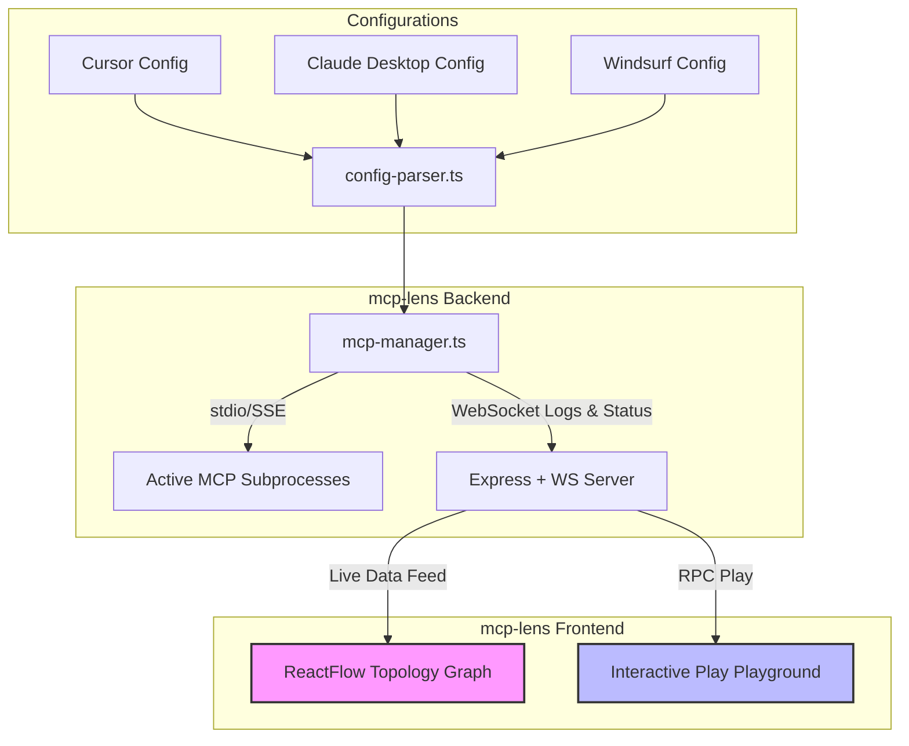

<p align="center">
  <h1 align="center">🔎 mcp-lens</h1>
  <p align="center">
    <strong>The Interactive Visual Dashboard & Workspace Topology Mapper for Model Context Protocol (MCP) Servers.</strong>
  </p>
  <p align="center">
    <a href="https://github.com/shivamtyagi18/mcp-lens/stargazers"></a>
    <a href="https://github.com/shivamtyagi18/mcp-lens/blob/main/LICENSE"></a>
    
  </p>
</p>

---

## 🚀 What is mcp-lens?

**mcp-lens** is a local, zero-config visual workspace supervisor for developers working with the Model Context Protocol (MCP). It automatically aggregates, maps, and tests all active MCP servers configured across your environment (Cursor, Windsurf, and Claude Desktop) from a single glassmorphic dashboard.



---

## ✨ Features

*   **🔌 Universal Aggregator**: Scan and run Cursor, Windsurf, and Claude Desktop configuration servers simultaneously.
*   **🕸️ Interactive Topology Graph**: View server dependencies, resources, and tool cross-references styled in a premium dark mode dashboard using `ReactFlow`.
*   **⚡ RPC Tool Playground**: Instantly test server tools on-the-fly with dynamically generated JSON forms—no AI client required.
*   **⏱️ Observability & Logging**: Monitor tool execution latency and stream stderr logs from subprocesses in real-time.

---

## 📦 Quick Start

### Run Instantly via npx
```bash
npx mcp-lens
```

### Local Setup & Development
1. **Clone the repository:**
   ```bash
   git clone https://github.com/shivamtyagi18/mcp-lens.git
   cd mcp-lens
   ```
2. **Install dependencies:**
   ```bash
   npm install
   ```
3. **Start the development servers (Backend & Frontend concurrently):**
   ```bash
   npm run dev
   ```

Open **`http://localhost:5173`** to view your dashboard.

---

## 🤝 Contributing

Contributions are welcome! Feel free to open an issue or submit a pull request. 

Give us a star ⭐ if you find this tool helpful!
